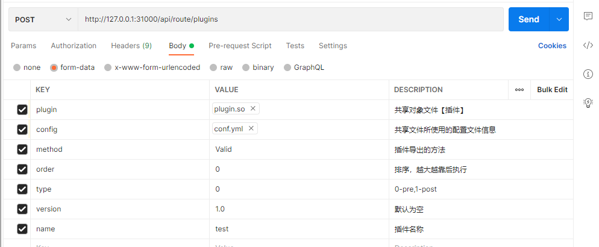

# 路由服务
## 简介
isc-route-service是物联网操作系统中一种高性能的请求代理方法。可以作为统一的请求接入层。它具备以下能力：
+ 流量控制
+ 服务发现(基于K8s)
+ 可扩展的插件机制
+ 路由分发（HTTP）
+ 健康检查（/api/route/system/status）
+ 链路跟踪
+ 动态加载路由规则
+ 动态加载插件执行规则
## 模块
- docker 编译运行模块，用于docker构建，包含docker构建命令
- pkg 源码模块
  - domain 领域模型，路由规则加载、应用初始话、插件信息加载等内容
  - exception 异常处理模型
  - handler 路由自身业务模型
  - middleware 中间件加载模型
  - proxy 代理模型
  - ratelimit 限流拦截处理
  - tracer 链路跟踪处理
- plugins 插件信息
  - accessToken 
  - appauth 应用授权鉴权
  - license 授权鉴权
  - login 登录鉴权
  - common 插件的公共内容，**慎重改动**，改动common需要重新构建所有的相关plugin信息
- utils 一些工具
- watcher 监听器，监听文件变化、消息推送或者配置中心内容变更等
- resources 静态或配置资源
## 版本
### v1.0.0
初始版本，仅支持http请求和路径匹配转发，不支持Cookie、QueryString、Header、Path等信息进行流量分发
#### 版本特性
- 兼容：支持路由规则与Mysql数据同步，同步仅一次
- 轻量：内存占用较少，空载仅10M
- 支持动态加载路由规则和插件信息
- 支持插件上传
- 支持路由规则动态更新
- 支持自定义截取路由规则，自定义Predicate
- 支持License鉴权、登录鉴权、限流等
- 支持多租户处理与应用鉴权
- 支持AccessToken校验
- 暂不支持非http协议转发和http协议转换为其他RPC协议
- 支持自定义登陆鉴权白名单
- 支持自定义超时延迟白名单，延迟到5M
#### 可用镜像
```shell
docker pull 10.30.30.22:9080/isyscore/isc-route-service:v4.0.0.20220307-dev
```

## 运行方式
**注意**
可运行文件的配置信息放置到output目录下，如果程序无法运行，请自行拷贝对应文件到根目录下
```ssh
# 运行时可以指明配置未知，否则会加载默认值
 -conf /mnt/d/worksapace/go/isc-route-service/resources/routeInfo.json -plugins /mnt/d/worksapace/go/isc-route-service/resources/plugins.json
```
### 插件构建命令
[compile.sh](plugins/compile.sh)
示例 ：
```shell
## 构建login插件
cd /home/isc-route-service/plugins
./compile.sh login 
## 插件将会被输出到 ../output/plugins/login/plugin.so
```
当执行镜像构建命令时，该插件将会被一起打包

### 镜像构建命令
[build.sh](docker/build.sh)
+ 收集output目录下所有的文件并构建成可执行文件
+ 默认使用Ubuntu 20.4作为基础镜像，也可以使用10.30.30.22:9080/isyscore/golang:1.18beta2-alpine3.15 + gcc +  musl-dev

##错误码
异常码均遵循指令集异常码规范，路由服务的code前缀1040~,例如1040400 = BadRequest,1040502 = BadGateway等
无其他特殊异常码

## 使用方法
### 配置信息
```yaml
server:
  # 服务端口号
  port: 31000
  # 日志相关设置
  logging:
    # 日志级别设置，默认info
    level: info
  # 限流设置，默认512/s
  limit: 512
  # 是否开启兼容模式，兼容模式将从mysql数据库中读取路由规则信息
  compatible: true

# redis相关设置
redis:
  addrs:
    - redis-service:26379
  password: ZljIsysc0re123
  db: 7
# loki日志服务器
loki:
  # 服务器地址
  host: http://loki-service:3100
  # 是否启用loki服务器，默认false，不启用
  enable: true
# 注册中心相关处理
rc:
  # 注册中心服务地址
  host: http://isc-rc-application-service:34200
  # 获取应用code地址信息
  relevance: "/api/rc-application/application/service/relevance"

mysql:
  host: mysql-service:23306
  user_name: isyscore
  password: Isysc0re
  data_base: isc_service
```

### 新增/修改路由规则
```text
curl --silent --location --request POST 'http://10.30.30.78:38080/api/route/refreshRoute' \
--header 'Content-Type: application/json' \
--data-raw '{
            "path": "/api/apix/**",
            "serviceId": "isc-apix-service",
            "url": "http://isc-apix-service:31001",
            "excludeUrl":"/api/apix/**",
            "specialUrl":"/api/apix/**",
            "predicate":["stripPrefix=2"]
}'
```
### 新增插件信息
_不允许重复上传插件_

```text
curl --silent --location --request POST 'http://127.0.0.1:31000/api/route/plugins' \
--header 'token: f0d52a55-677e-438a-b9fe-83727b195707' \
--form 'plugin=@"/D:/worksapace/go/isc-route-service/output/plugins/appauth/plugin.so"' \
--form 'config=@"/D:/worksapace/go/isc-route-service/output/plugins/appauth/conf.yml"' \
--form 'method="Valid"' \
--form 'order="0"' \
--form 'type="0"' \
--form 'version="1.0"' \
--form 'name="test"'
```
